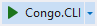

# Installation Instruction

The project implements game platform for playing `Congo` locally or via network.

There are two options for client software:

- [Congo.CLI](#congocli) with terminal-based user interface.
- [Congo.GUI](#congogui) with graphical user interface.

For server application, please deploy [Congo.Server](#congoserver). Server starts at `http://localhost:5153` and `https://localhost:7153` depending on the protocol. A client should use the same connection identifiers, which are specified during game initialization. The ability of the server to run over the Internet has not been tested
due to the hardware limitations.

Note that all executables in the `*-exe.zip` archives are self-contained and neither require installation, nor `root` permissions for running.

**Contents**

- [Congo.CLI](#congocli)
  - [Installing Congo.CLI on Windows](#installing-congocli-on-windows)
  - [Installing Congo.CLI on Linux](#installing-congocli-on-linux)
- [Congo.GUI](#congogui)
- [Congo.Server](#congoserver)
- [Compile and run in the terminal](#compile-and-run-in-the-terminal)
- [Compile and run in Visual Studio](#compile-and-run-in-visual-studio)
- [Publishing a project](#publishing-a-project)
- [Creating .msi file](#creating-msi-file)
- [Release archives](#release-archives)

# Congo.CLI

`Congo.CLI` is currently supported on both `Windows` and `Linux` operating systems. We further describe installation procedures for each platform separately.

## Installing Congo.CLI on Windows

- Download the latest `congo-cli-win-x64-<VERSION>-msi.zip` and unpack archive.

- Double left-click on the `setup.exe` starts standard installation wizard.

- Go through the installation by clicking `Next` button.

- Relevant executable can be found in `C:\Program Files\Noname\Congo.CLI`.

- The program could be uninstalled via `Control Panel`.

To make `Congo.CLI` available in the `$PATH`, proceed as follows.

- Open `Start` menu and type in `Edit the system environment variables`. Press `Enter`.

- Press the button `Environment Variables...`.

- Find `Path` variable in the `User variables for ...` table. Open it for `Edit`.

- Add `New` row containing `C:\Program Files\Noname\Congo.CLI`.

## Installing Congo.CLI on Linux

- Download the latest `congo-cli-linux-x64-<VERSION>-exe.zip` and unpack the archive.

- Copy `Congo.CLI` executable to the `/usr/bin/` folder making it available in the `$PATH`. Note that copying requires `root` permissions, but running the executable does not need escalating privileges. `Congo.CLI` could be placed in any directory available in the `$PATH`.

```console
sudo cp ./Congo.CLI /usr/bin/
```

# Congo.GUI

`Congo.GUI` exploits `WPF` technology making the project `Windows`-dependent.

- Download the latest `congo-gui-win-x64-<VERSION>-msi.zip` and unpack archive.

- Double left-click on the `setup.exe` starts standard installation wizard.

- Go through the installation by clicking `Next` button.

- Relevant executable can be found in `C:\Program Files\Noname\Congo.GUI`.

- Installation create a link on the user's `Desktop` and in the `Start` menu under `Congo` folder.

- The program could be uninstalled via `Control Panel`.

# Congo.Server

This project is treated differently than other projects. We avoid installing software, because server executable uses additional configuration files. These files shall be placed in the same folder, from which we start executable. Making `Congo.Server` available in the `$PATH` would not work properly in all scenarios. Both `Windows` and `Linux` versions use similar deployment procedure.

- Download release archive `congo-server-<platform>-<version>-exe.zip`.

- Unpack archive into the folder of choice.

- Navigate to this folder in the terminal and run `Congo.Server`.

- Wait until server instance reports successful start.

```console
info: Microsoft.Hosting.Lifetime[14]
      Now listening on: http://localhost:5153
info: Microsoft.Hosting.Lifetime[14]
      Now listening on: https://localhost:7153
info: Microsoft.Hosting.Lifetime[0]
      Application started. Press Ctrl+C to shut down.
```

Note that the user cannot interact with the server instance, but could shut it down by pressing `Ctrl+C`.

# Compile and run in the terminal

Each project can be built, run and tested directly from the terminal. [dotnet](https://docs.microsoft.com/en-us/dotnet/core/tools/dotnet) should be available on the target system.

- Clone the latest working version of the solution or download release files.

- Navigate to the project folder of choice, e.g. `Congo.CLI`.

- Execute `dotnet build` or `dotnet run ...` with relevant arguments.

# Compile and run in Visual Studio

For developers preferring `Visual Studio`, we further describe a relevant procedure for building and running within this specific `IDE`.

- Open `Visual Studio Community 2022`.
- Left click on `Clone a repository` in the upper right corner.
- Insert `https://github.com/zhukovdm/Congo` into `Repository location` field.
- Right click on `Clone` in the bottom right corner.
- `Open` the solution.


- Restore `NuGet` packages.


- Select relevant project in `Startup Projects`.

- Press  to compile and run the project.

# Publishing a project

Projects are published as a self-contained binary files. Placeholder `<RID>` can be replaced by any runtime identifier from the [.NET RID Catalog](https://docs.microsoft.com/en-us/dotnet/core/rid-catalog). Currently, `win-x64` and `linux-x64` platforms are supported.

- Navigate to the root folder of `Congo.CLI`, `Congo.GUI` or `Congo.Server`.

- Execute the following command in the terminal. `dotnet` utility shall be installed on the target system.

```console
dotnet publish -r <RID> -c Release -o publish --self-contained true -p:PublishSingleFile=true -p:PublishReadyToRun=true -p:IncludeNativeLibrariesForSelfExtract=true
```

- Generated files are dumped into the `./publish/` folder.

`Congo.Server` is compiled into an executable with several additional files (`*.json`, `*.config`, etc.). **All** these files should be included into release archive.

# Creating .msi file

`.msi` files are used for proper installation, maintenance, and removal of software within `Windows` systems. `Congo.CLI` and `Congo.GUI` are supposed to have installation files, which are built by a special `.Installer` projects. To generate `.msi` file, proceed as follows.

- Publish a working version of a project, refer to [Publishing a project](#publishing-a-project) for details.

- Open `Congo` solution in the `Visual Studio` and (re-)build relevant `.Installer` project.

- `.msi` and the corresponding `setup.exe` could be found in the `./Release/` folder.

# Creating release archives

Projects are released as a separated self-contained `.zip` files with structured names `<project>-<platform>-<version>-<kind>.zip`. An example of archive name is `congo-cli-linux-x64-v1.0.0-exe.zip`.
