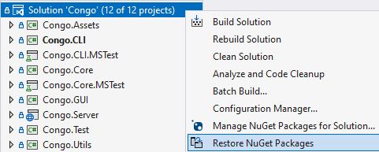

# Installation Instruction

The project implements game platform to play `Congo` locally or via network.

There are two options for client software:
- [congo-cli](#congo-cli) with command-line user interface.
- [congo-gui](#congo-gui) with graphical user interface

For server application, please install [congo-server](#congo-server). Server
starts at `http://localhost:5153` and `https://localhost:7153` depending on the
protocol. A client should use the same connection identifiers when calling remote
procedures. The ability of the server to run over the Internet has not been tested
due to the hardware limitations.

## congo-cli

TBA

## congo-gui

TBA

`GUI client` is programmed in `WPF` and

Before installation, ensure that the following technologies are available
on the target system:
- `Windows 10`,
- `dotnet-6.0.300`

## congo-server

TBA

Server has only terminal-based user interface and having installed
`dotnet-6.0.300` is enough to run an instance. Therefore, server project
is platform independent.

## Compile from sources and run

- Open `Visual Studio Community 2022`.
- Left click on `Clone a repository` in the upper right corner.
- Insert `https://github.com/zhukovdm/Congo` into `Repository location` field.
- Right click on `Clone` in the bottom right corner.
- `Open` the solution.

- Restore NuGet packages.

- Press `Ctrl+Shift+B` to build entire solution.
- Press `Ctrl+F5` to start the game.
