# User's Manual

The purpose of this document is to describe rules, gameplay and user interface of the platform for
playing the board game `Congo` locally or over `IPv4` network.

**Contents**

- [Definitions](#definitions)
- [Rules](#rules)
- [Congo FEN](#congo-fen)
- [Terminal-based user interface](#terminal-based-user-interface)
  - [Setting up](#setting-up)
  - [Gameplay](#gameplay)
    - [Local games](#local-games)
    - [Network games](#network-games)
- [Graphical user interface](#graphical-user-interface)
  - [Setting up](#setting-up-1)
  - [Gameplay](#gameplay-1)
- [References](#references)

# Definitions

`Congo` is an abstract game (chess variant) popular in the Netherlands.

`Board` is a flat surface with specific pattern of squares, on which pieces are placed. Congo board
contains $7 \times 7$ squares.

`Rank` is a horizontal row of squares on the board. `Congo` board has $7$ ranks, marked from $1$ to $7$.

`File` is a vertical column of squares on the board. `Congo` board has $7$ files, marked from $A$ to $G$.

`Piece` is any figure on the board used by the players to play the game.

`Capture` is an action when active player's move removes its opponent's piece from the board.

`River` is the middle $4$<sup>th</sup> rank of the board. Such squares have special behavior towards
animal pieces, which is described in the next chapter.

`Castle` is a $3 \times 3$ square at each side of the board, namely squares
$\lbrace C, D, E \rbrace \times \lbrace 1, 2, 3 \rbrace$ for black lion and
$\lbrace C, D, E \rbrace \times \lbrace 5, 6, 7 \rbrace$ for white.

`Congo FEN` is a description of the immediate state of the `Congo` game in textual form. `FEN`
abbreviation is borrowed from the well-known `Forsyth-Edwards Notation` for describing board
position in chess. More on the subjects at [Congo FEN](#congo-fen).

# Rules

Read [this article](https://en.wikipedia.org/wiki/Congo_(chess_variant)) to understand details
about `Congo` rules and game flow. For more information regarding rules and other game
implementations, please refer to the [References](#references). We further describe things relevant
for the platform.

There are two competing players in the game, black denoted by  and
white denoted by . Players alternate turns, passing is not possible.
Further, we describe the behavior of each piece and the aim of the game.

<table>
  <thead>
    <tr>
      <th align="center">Picture</th>
      <th align="center">Symbol</th>
      <th align="left">Description</th>
    </tr>
  </thead>
  <tbody>
    <tr>
      <td align="center">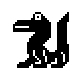</td>
      <td align="center"><code>C,c</code></td>
      <td align="left">
        <code>Crocodile</code> moves as the King in Chess standing on the ground. Outside the river
        it can slide straight towards the river (including the river square) as a rook if no pieces
        are standing on the path. Inside the river it can slide to another river square as a rook.
      </td>
    </tr>
    <tr>
      <td align="center">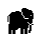</td>
      <td align="center"><code>E,e</code></td>
      <td align="left">
        <code>Elephant</code> jumps one or two squares in the horizontal or vertical direction.
        It may jump over the nearest square (also river) and capture the piece on the next square.
      </td>
    </tr>
    <tr>
      <td align="center"></td>
      <td align="center"><code>G,g</code></td>
      <td align="left">
        <code>Giraffe</code> performs non-capturing moves in any direction (as the chess King).
        It can move or capture two steps away in horizontal, vertical or diagonal direction.
      </td>
    </tr>
    <tr>
      <td align="center">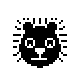</td>
      <td align="center"><code>L,l</code></td>
      <td align="left">
        <code>Lion</code> is the King of the Jungle. It cannot leave its castle. Inside the castle,
        it moves and captures as the King in Chess. If there is a vertical or diagonal line with no
        pieces between the two lions, the lion may jump to the other lion and capture it.
      </td>
    </tr>
    <tr>
      <td align="center">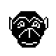</td>
      <td align="center"><code>M,m</code></td>
      <td align="left">
        <code>Monkey</code> moves as the King in Chess while not capturing. It captures a piece by
        jumping over it in any direction to the square immediately beyond, which <b>must</b> be
        vacant. A monkey may capture multiple pieces during the same turn, but is not obliged to do
        so. Monkey jump can be interrupted at any time. Once a monkey jumps over a piece, the piece
        immediately disappears. If a monkey starts multiple capture being at a river square and
        ends at any river square, it immediately drowns. If a monkey starts its jump on the ground
        and ends in the river or opposite, it is not drown. Captures before drowning are legal.
        The monkey captured opponent's Lion terminates the move and the game.
      </td>
    </tr>
    <tr>
      <td align="center"></td>
      <td align="center"><code>P,p</code></td>
      <td align="left">
        <code>Pawn</code> moves and captures both straight and diagonally forward. Being on the
        other side of the river, a pawn may also slide one or two squares straight back, without
        the right to capture or jump over pieces. If a pawn reaches the last opposite row, it is
        promoted to a superpawn.
      </td>
    </tr>
    <tr>
      <td align="center">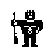</td>
      <td align="center"><code>S,s</code></td>
      <td align="left">
        <code>Superpawn</code> has the additional powers of moving and capturing one square straight
        sideways and going one or two square straight backwards or diagonally backward. When going
        backwards, it may neither capture nor jump. A superpawn can slide backwards standing at any
        square.
      </td>
    </tr>
    <tr>
      <td align="center"></td>
      <td align="center"><code>Z,z</code></td>
      <td align="left">
        <code>Zebra</code> moves as the Knight in classic chess.
      </td>
    </tr>
  </tbody>
</table>

The aim of the game is to win by capturing opponent's `Lion` as there could be only one King of the
Jungle. The game immediately ends once a lion, either black or white, is captured. There is no
chess-like check in `Congo`, a lion might move to an attacked square. Consequently, `Congo` has no
draw by a stalemate.

A non-crocodile piece that ends its move standing on the river square must reach a ground square in
the next turn, otherwise the piece disappears as being drown. Crocodiles **cannot** drown.

# Congo FEN

Any `Congo` game can be encoded into a string with $9$ sections divided by a `/`, e.g.
`rank/rank/rank/rank/rank/rank/rank/color/jump`.

First $7$ sections encode ranks. Squares are described from left to right. Digits indicate
consequent empty squares, letters indicate pieces (see symbols in the table above).

$8$<sup>th</sup> section denote a color of the active player. White and black players are denoted
by `w` and `b` respectively.

$9$<sup>th</sup> item describes a position, where monkey jump has started. The last field is set
to $-1$ if monkey jump has not been started. Otherwise, there is a square number, from which monkey
has started its jump. Squares are counted from left to right starting at the upper left corner
towards the bottom, e.g. `a7` has index $0$.

Standard board with white player's turn.
```txt
gmelecz/ppppppp/7/7/7/PPPPPPP/GMELECZ/w/-1
```

Board with plenty of moves.
```txt
1melec1/ppppp1p/2g2zp/5C1/2G2ZP/PPPPP1P/1MELE2/b/-1
```

$3$-long white monkey jump, white wins.
```txt
7/4l2/7/4c2/7/2p4/1M1L3/w/-1
```

# Terminal-based user interface

`Congo.CLI` is a terminal-based client application. The game is configured via arguments on
application start. Options could have different sets of allowed values depending on the locality
of the game. The order of options is not important.

## Setting up

To start **local** game, use the following arguments:

- `--place` decides locality of the game, `local` or `network`.
- `--game` starts `standard` game or restores game from valid `Congo FEN`.
- `--white` **and** `--black` value consists of two parts: kind of intelligence (`ai` or `hi`) and 
  an algorithm for advising next move (currently `random` and `negamax` are supported). Computer
  player uses advising algorithm in each move.

```txt
Congo.CLI --place=local --game=standard --white=hi/negamax --black=ai/negamax
```

To start **network** game, use the following arguments:

- `--place` has a meaning similar to the previous paragraph.
- `--host` is an `IPv4` address of the game server.
- `--port` is an accepting port of the game server.
- `--game` creates `standard` game or new game from valid `Congo FEN` or connects already existing
  game by `id`. The unique game `id` is generated by the server for all newly created `standard`
  and `Congo FEN` games.
- `--white` **or** `--black` defines local player and its advising function.

```txt
Congo.CLI --place=network --host=localhost --port=7153 --game=standard --white=hi/negamax
```

Note that `Server` instance should be reachable on the network prior to creating network game.
Otherwise, the program terminates.

## Gameplay

### Local games

Let's consider a gameplay for local games. A game is started with a text greeting the user.
Current position on the board and players with summed up piece occupancies follow.

```txt
   ____
  / ___|___  _ __   __ _  ___
 | |   / _ \| '_ \ / _` |/ _ \
 | |__| (_) | | | | (_| | (_) |
  \____\___/|_| |_|\__, |\___/
                   |___/

 7   g m e l e c z
 6   p p p p p p p
 5   - - - - - - -
 4   + + + + + + +
 3   - - - - - - -
 2   P P P P P P P
 1   G M E L E C Z

 /   a b c d e f g

 * white 2E 1Z 1G 1C 7P 0S 1L 1M
   black 2e 1z 1g 1c 7p 0s 1l 1m

 > _
```

The user interact with the interface by entering commands into command line. If the user attempts
to enter unsupported command, the program properly informs the user.

```txt
 > unknown
 Command unknown is not supported. Consult "help help".
```

Currently $5$ commands are supported: `advise`, `exit`, `help`, `move` and `show`. All of them have
`man` page, which is retrieved by `help` command.

```txt
 > help move
 NAME
    move
 DESCRIPTION
    Moves a certain piece from a square to a square.
 USAGE
    move [a-g][1-7] [a-g][1-7]
```

During the game, a player could print out current board, players or available moves via `show` command.

```txt
 > show board

 7   g m e l e c z
 6   p p p p p p p
 5   - - - - - - -
 4   + + + + + + +
 3   - - - - - - -
 2   P P P P P P P
 1   G M E L E C Z

 /   a b c d e f g

 > show players

 * white 2E 1Z 1G 1C 7P 0S 1L 1M
   black 2e 1z 1g 1c 7p 0s 1l 1m

 > show moves

 (a2,a3) (a2,b3) (b2,a3) (b2,b3) (b2,c3)
 (c2,b3) (c2,c3) (c2,d3) (d2,c3) (d2,d3)
 (d2,e3) (e2,d3) (e2,e3) (e2,f3) (f2,e3)
 (f2,f3) (f2,g3) (g2,f3) (g2,g3) (a1,a3)
 (a1,c3) (c1,c3) (e1,e3) (g1,f3)
```

Current player could move pieces using `move` command. `ai` players generate moves automatically
and do not use `move` command. Any transition is additionally reported. New board position is shown
immediately after the transition. Wrong moves made by the user are reported.

```txt
 > move a2 a3

 transition (a2,a3)

 7   g m e l e c z
 6   p p p p p p p
 5   - - - - - - -
 4   + + + + + + +
 3   P - - - - - -
 2   - P P P P P P
 1   G M E L E C Z

 /   a b c d e f g

 > move a1 b3
 Entered move is wrong. Consult "show moves".
```

Next move can be advised by the algorithm provided in the arguments. Currently `random` (random
choice) and `negamax` (recursive method with evaluation function) are supported.

```txt
 > advise
 Advised move is (b1,a2).
```

The game is exited upon entering `exit` command.

```txt
 > exit
The program is terminated...
```

### Network games

Games via the **network** have a similar gameplay, differences are described below.

Unique game identifier is generated by the server and reported immediately after the greeting
message. Keep game identifier to access the game later.

```txt
   ____
  / ___|___  _ __   __ _  ___
 | |   / _ \| '_ \ / _` |/ _ \
 | |__| (_) | | | | (_| | (_) |
  \____\___/|_| |_|\__, |\___/
                   |___/

 network gameId 9

 7   g m e l e c z
 6   p p p p p p p
 5   - - - - - - -
 4   + + + + + + +
 3   - - - - - - -
 2   P P P P P P P
 1   G M E L E C Z

 /   a b c d e f g

 * white 2E 1Z 1G 1C 7P 0S 1L 1M
   black 2e 1z 1g 1c 7p 0s 1l 1m
```

Once active user makes a move, transition is reported and move is posted on the server. The program
waits for a new game state until opponent makes its move.

```txt
 > move d2 d3

 transition (d2,d3)

 7   g m e l e c z
 6   p p p p p p p
 5   - - - - - - -
 4   + + + + + + +
 3   - - - P - - -
 2   P P P - P P P
 1   G M E L E C Z

 /   a b c d e f g

 ..........
```

Due to a possible monkey jump, the opponent could make more than one move. All such moves are
received from the server and properly reported.

```txt
 transitions (b1,d3) -> (d3,f5) -> (f5,f5)
```

Note that network game could be interrupted at any time. The same game could be repeatedly accessed
by unique game identifier.

# Graphical user interface

`Congo.GUI` is a `WPF`-based graphical client application.

## Setting up

The `Congo.GUI` application starts as a window with empty board.

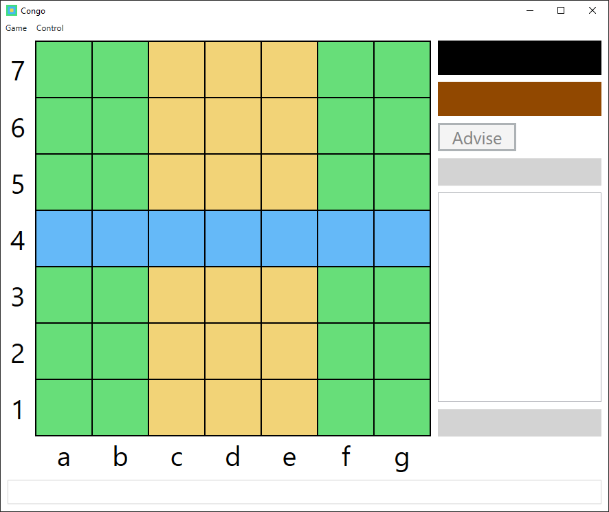

New game can be initialized using `Local` or `Network` popup. Both could be found in the `Game` menu.

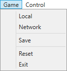

For local game, the user decides a configuration and players.

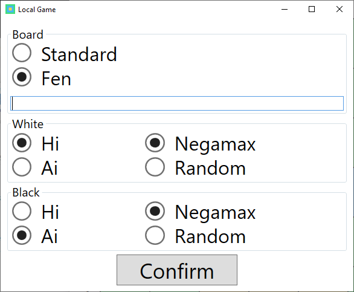

For network game, the user decides connection parameters and configuration for the local player.

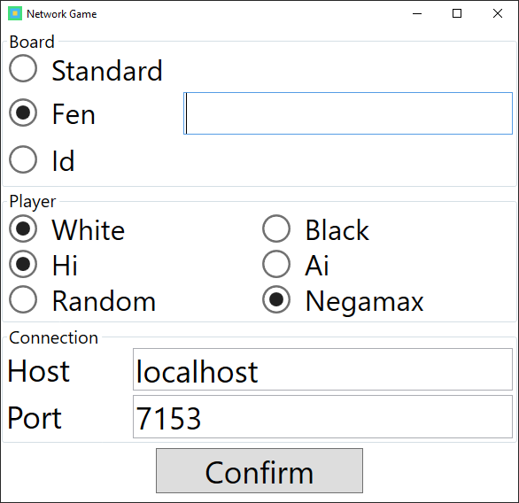

`Save` button serializes current game state (if available) as a `Congo FEN` string and copies
it into system buffer. The user could paste it anywhere else by pressing `Ctrl+V`.

`Reset` button finalizes all relations (e.g. open connections) and reset the program into initial
state with an empty board.

`Exit` button finalizes all relations and terminates the program.

## Gameplay

Once the game is configured and set, all available pieces show up.

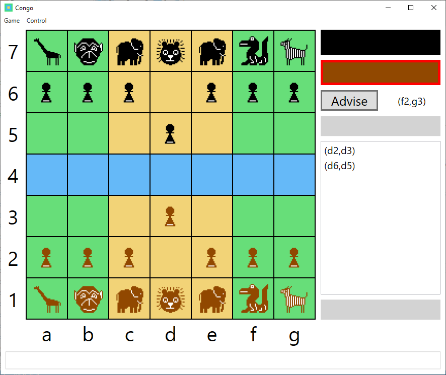

Active user (either black or white) is indicated by a red border around the corresponding rectangle.


Advice can be ordered by the user by pressing `Advise` button. The task is calculated within
a parallel thread and main window does not hang. The advised move shows up next to the button.

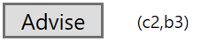

Upper grey rectangle of the status panel contain the unique game identifier for the network game.
The content of the text block can be copied to the system buffer upon `MouseUp` event on the
element. Moves are stored in the list box, moves made by a remote player are synchronized. Winner
is reported in the bottom text block of the status panel.

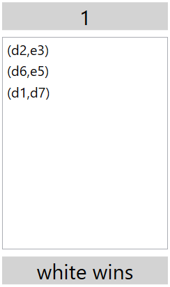

The user could select a tile with a friendly piece. Selected tile is highlighted by the white
border, target tiles are highlighted with the red border. Clicking on unrelevant tiles does not
have any effect on the game state.

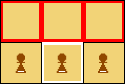

The client communicates with the server on demand (new game is created, move is done, etc.) and
cannot immediately recognize broken connection. Any problems related to the communication with the
server are reported in the bottom text block with prefix `gRPC error: StatusCode=...`. The meaning of
each status code is explained [here](https://grpc.github.io/grpc/csharp/api/Grpc.Core.StatusCode.html).

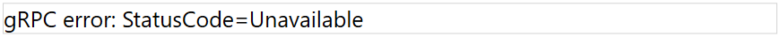

The client communicates with the server in an asynchronous manner by passing messages back and
forth. There is no session abstraction. Any user can connect and continue playing network game at
any time. It could happen, that the user makes valid move on unsynchronized game. Such situations
are detected and properly reported with `Server response error: ` prefix.

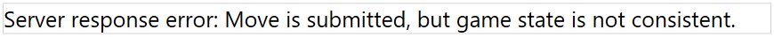

The game effectively ends upon communication or synchronization error.

Buttons in the `Control` menu have rather special meaning.

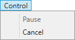

`Pause` is enabled whenever the game is local and both players are `Ai`. The user could interrupt
game flow and analyze position or copy current game state via `Save` button. The game flow
is resumed by a repeated clicking.

`Negamax` is a recursive algorithm and could be time and resource heavy. To avoid waiting a result
for too long, advising calculation could be cancelled via `Cancel` button. The program will select
best known move or pick random.

# References

- [Chess variants/Congo](https://www.chessvariants.com/ms.dir/congo.html)
- [Wikipedia/Glossary of chess](https://en.wikipedia.org/wiki/Glossary_of_chess)
- [Wikipedia/Congo (chess variant)](https://en.wikipedia.org/wiki/Congo_(chess_variant))
- [Mindsports/Interesting game/Congo](https://www.mindsports.nl/index.php/side-dishes/interesting-games?start=2)
