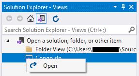

Please, note that the project is currently under construction.

# Congo

This project is a .NET implementation of the board game `Congo`.

## System requirements

Before installation ensure that the following technologies are available
on the target system:
- `Windows 10`,
- `.NET Framework 4.8`,
- `Visual Studio 2019`.

## Installation

- Open `Visual Studio 2019`.
- Click on `Clone a repository` in the upper right corner.
- Insert `https://github.com/zhukovdm/Congo` into `Repository location` field.
- Click on `Clone` in the bottom right corner.
- `Open` the solution.
  
- Press `Ctrl + F5`.

## Gameplay

Check out the [User's manual](./resources/docs/um.pdf) to learn more about rules and
game control.

## References

- [Mindsports - Interesting game - Congo](https://www.mindsports.nl/index.php/side-dishes/interesting-games?start=2)
- [Wikipedia - Glossary of chess](https://en.wikipedia.org/wiki/Glossary_of_chess)
- [Wikipedia - Congo (chess variant)](https://en.wikipedia.org/wiki/Congo_(chess_variant))
- [Chess variants - Congo](https://www.chessvariants.com/ms.dir/congo.html)
- [Chess Programming Wiki](https://www.chessprogramming.org/)
- [Computer Chess Programming Theory](http://www.frayn.net/beowulf/theory.html)
