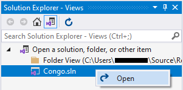
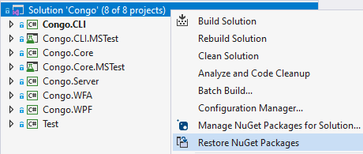
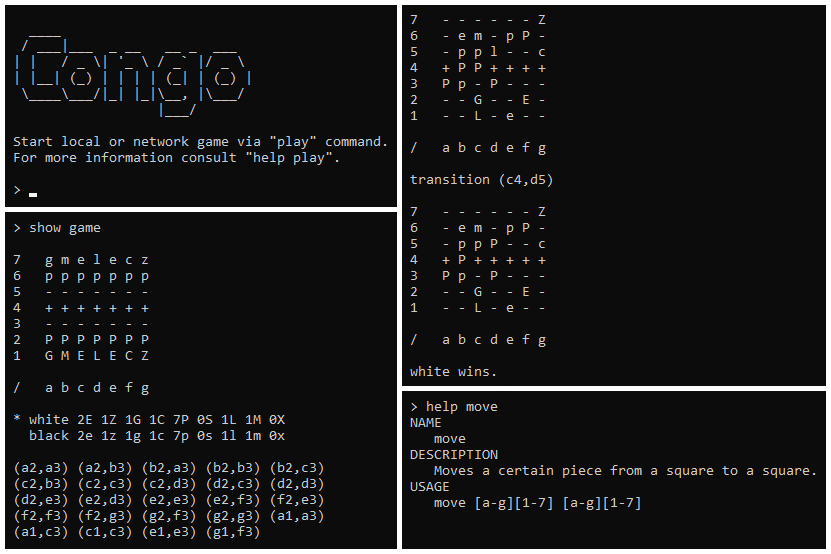

# Congo

This project is a .NET implementation of the board game `Congo`.

## System requirements

Before installation, ensure that the following technologies are available
on the target system:
- `Windows 10`,
- `.NET Framework 4.8`,
- `Visual Studio Community 2019`.

## Installation

- Open `Visual Studio Community 2019`.
- Left click on `Clone a repository` in the upper right corner.
- Insert `https://github.com/zhukovdm/Congo` into `Repository location` field.
- Right click on `Clone` in the bottom right corner.
- `Open` the solution.


- Restore NuGet packages.


- Press `Ctrl+Shift+B` to build entire solution.
- Press `Ctrl+F5` to start the game.

## Gameplay

To start standard game against computer copy and paste the following.
```console
play local
game standard
hi
ai
```


